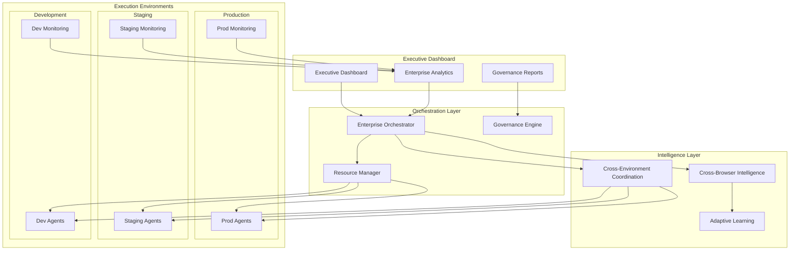

# Exercise 7: Advanced Agent Workflows & Multi-Environment Orchestration

**Time:** 35 minutes  
**Objective:** Design and implement sophisticated agent workflows for enterprise-scale testing across multiple environments, browsers, and coordination patterns

## What You Will Learn

- Orchestrating complex agent workflows across development, staging, and production environments
- Building cross-browser intelligence and device-aware testing strategies
- Implementing enterprise governance and compliance for agent-driven testing
- Creating advanced coordination patterns for large-scale, distributed test ecosystems

## The Enterprise Scale: From Simple to Sophisticated Orchestration

### Basic Agent Coordination

```javascript
// Simple single-environment execution
await agent.execute([
  { test: 'login', browser: 'chrome' },
  { test: 'purchase', browser: 'chrome' }
]);
```

### Enterprise Agent Orchestration

```javascript
// Multi-environment, cross-browser, intelligent coordination
const orchestration = await enterpriseOrchestrator.coordinate({
  environments: ['dev', 'staging', 'prod'],
  browsers: ['chrome', 'firefox', 'safari', 'edge'],
  devices: ['desktop', 'mobile', 'tablet'],
  regions: ['us-east', 'eu-west', 'asia-pacific'],
  governance: {
    compliance: 'SOX', 
    dataResidency: 'enforced',
    auditTrail: 'complete'
  },
  intelligence: {
    crossEnvironmentLearning: true,
    browserAdaptation: true,
    performanceOptimization: true
  }
});
```

## Instructions

### Step 1: Design Multi-Environment Agent Architecture (15 minutes)

1. **Create environment-aware agent orchestrator:**

   ```javascript
   // src/orchestration/enterprise-orchestrator.js
   class EnterpriseAgentOrchestrator {
     constructor(config) {
       this.environments = new EnvironmentManager(config.environments);
       this.governance = new GovernanceEngine(config.governance);
       this.intelligence = new CrossEnvironmentIntelligence();
       this.coordination = new GlobalCoordination();
       this.compliance = new ComplianceManager();
     }

     async orchestrateEnterpriseTesting(testStrategy) {
       console.log('🏢 Starting enterprise-scale agent orchestration...');
       
       // Validate governance requirements
       await this.governance.validateStrategy(testStrategy);
       
       // Plan cross-environment execution
       const executionPlan = await this.planExecution(testStrategy);
       
       // Deploy agents across environments
       const deployments = await this.deployAgentFleets(executionPlan);
       
       // Coordinate intelligent execution
       const results = await this.coordinateExecution(deployments, executionPlan);
       
       // Ensure compliance and audit
       await this.compliance.recordExecution(results);
       
       return results;
     }

     async planExecution(testStrategy) {
       const plan = {
         environments: await this.selectEnvironments(testStrategy),
         agentDistribution: await this.optimizeAgentDistribution(testStrategy),
         executionSequence: await this.designExecutionFlow(testStrategy),
         failoverStrategy: await this.createFailoverPlan(testStrategy),
         complianceRequirements: await this.mapComplianceRequirements(testStrategy)
       };

       // Cross-environment intelligence planning
       plan.intelligenceStrategy = await this.intelligence.planCrossEnvironmentLearning({
         environments: plan.environments,
         testTypes: testStrategy.testTypes,
         riskProfile: testStrategy.riskProfile
       });

       console.log(`📋 Execution plan created for ${plan.environments.length} environments`);
       return plan;
     }

     async deployAgentFleets(executionPlan) {
       const deployments = new Map();

       for (const env of executionPlan.environments) {
         console.log(`🚀 Deploying agent fleet to ${env.name}...`);

         const fleet = await this.deployEnvironmentFleet({
           environment: env,
           agentConfig: executionPlan.agentDistribution[env.name],
           governance: executionPlan.complianceRequirements[env.name]
         });

         // Cross-environment coordination setup
         await this.coordination.registerEnvironment(env.name, fleet);
         
         deployments.set(env.name, fleet);
       }

       // Establish inter-environment communication
       await this.coordination.establishCrossEnvironmentChannels(deployments);

       return deployments;
     }

     async coordinateExecution(deployments, executionPlan) {
       const coordinator = new CrossEnvironmentCoordinator(deployments);
       
       const results = {
         environmentResults: new Map(),
         crossEnvironmentInsights: {},
         complianceStatus: {},
         governanceAudit: {}
       };

       // Execute across environments with coordination
       const environmentPromises = Array.from(deployments).map(async ([envName, fleet]) => {
         const envExecutor = new EnvironmentExecutor(envName, fleet, this.intelligence);
         
         const envResults = await envExecutor.execute({
           tests: executionPlan.testsByEnvironment[envName],
           coordination: coordinator,
           governance: this.governance
         });

         results.environmentResults.set(envName, envResults);
         return { environment: envName, results: envResults };
       });

       await Promise.all(environmentPromises);

       // Generate cross-environment insights
       results.crossEnvironmentInsights = await this.intelligence.analyzeCrossEnvironment(results.environmentResults);
       
       // Validate compliance across environments
       results.complianceStatus = await this.compliance.validateCrossEnvironment(results);

       return results;
     }
   }
   ```

2. **Implement cross-browser intelligence:**

   ```javascript
   // src/intelligence/cross-browser-intelligence.js
   class CrossBrowserIntelligence {
     constructor() {
       this.browserProfiles = new Map();
       this.adaptationStrategies = new Map();
       this.learningEngine = new BrowserLearningEngine();
     }

     async initializeBrowserIntelligence(browsers) {
       console.log('🧠 Initializing cross-browser intelligence...');

       for (const browser of browsers) {
         const profile = await this.createBrowserProfile(browser);
         this.browserProfiles.set(browser, profile);
         
         // Initialize browser-specific adaptation strategies
         const strategies = await this.createAdaptationStrategies(browser, profile);
         this.adaptationStrategies.set(browser, strategies);
       }

       // Learn cross-browser patterns
       await this.learningEngine.initializeCrossBrowserLearning(this.browserProfiles);
       
       console.log(`✅ Browser intelligence initialized for ${browsers.length} browsers`);
     }

     async createBrowserProfile(browser) {
       return {
         name: browser,
         capabilities: await this.analyzeBrowserCapabilities(browser),
         quirks: await this.identifyBrowserQuirks(browser),
         performance: await this.measureBrowserPerformance(browser),
         selectors: await this.optimizeSelectorStrategies(browser),
         timing: await this.calibrateBrowserTiming(browser)
       };
     }

     async adaptTestForBrowser(test, targetBrowser) {
       const profile = this.browserProfiles.get(targetBrowser);
       const strategies = this.adaptationStrategies.get(targetBrowser);
       
       if (!profile || !strategies) {
         throw new Error(`Browser profile not found for: ${targetBrowser}`);
       }

       const adaptedTest = {
         ...test,
         selectors: await this.adaptSelectors(test.selectors, profile.selectors),
         timing: await this.adaptTiming(test.timing, profile.timing),
         actions: await this.adaptActions(test.actions, profile.capabilities),
         assertions: await this.adaptAssertions(test.assertions, profile.quirks)
       };

       // Apply browser-specific optimizations
       adaptedTest.optimizations = await strategies.optimize(adaptedTest);

       console.log(`🔄 Test adapted for ${targetBrowser}: ${adaptedTest.optimizations.length} optimizations applied`);
       return adaptedTest;
     }

     async learnFromCrossBrowserExecution(results) {
       const learningData = {
         browserResults: results.browserResults,
         crossBrowserPatterns: results.patterns,
         adaptationEffectiveness: results.adaptations
       };

       // Learn selector effectiveness across browsers
       await this.learningEngine.learnSelectorPatterns(learningData);
       
       // Learn timing optimizations
       await this.learningEngine.learnTimingPatterns(learningData);
       
       // Learn browser-specific failure patterns
       await this.learningEngine.learnFailurePatterns(learningData);

       // Update adaptation strategies
       for (const [browser, results] of learningData.browserResults) {
         const updatedStrategies = await this.learningEngine.updateStrategies(browser, results);
         this.adaptationStrategies.set(browser, updatedStrategies);
       }

       console.log('📚 Cross-browser learning completed');
       return {
         patternsLearned: learningData.crossBrowserPatterns.length,
         strategiesUpdated: this.adaptationStrategies.size,
         effectiveness: await this.calculateLearningEffectiveness(learningData)
       };
     }

     async generateBrowserCompatibilityReport(testResults) {
       const report = {
         summary: await this.generateCompatibilitySummary(testResults),
         browserAnalysis: await this.analyzeBrowserPerformance(testResults),
         recommendations: await this.generateCompatibilityRecommendations(testResults),
         trends: await this.analyzeBrowserTrends(testResults)
       };

       return report;
     }
   }
   ```

3. **Build enterprise governance engine:**

   ```javascript
   // src/governance/enterprise-governance.js
   class EnterpriseGovernanceEngine {
     constructor(config) {
       this.policies = new PolicyEngine(config.policies);
       this.compliance = new ComplianceFramework(config.compliance);
       this.audit = new AuditTrail(config.audit);
       this.dataGovernance = new DataGovernance(config.dataGovernance);
     }

     async validateTestStrategy(strategy) {
       console.log('🛡️ Validating test strategy against governance policies...');

       const validations = {
         dataCompliance: await this.validateDataCompliance(strategy),
         securityCompliance: await this.validateSecurityCompliance(strategy),
         regulatoryCompliance: await this.validateRegulatoryCompliance(strategy),
         operationalPolicies: await this.validateOperationalPolicies(strategy)
       };

       const violations = this.identifyViolations(validations);
       
       if (violations.length > 0) {
         const critical = violations.filter(v => v.severity === 'critical');
         if (critical.length > 0) {
           throw new GovernanceViolationError(`Critical violations found: ${critical.map(v => v.policy).join(', ')}`);
         }
       }

       await this.audit.recordValidation(strategy, validations, violations);
       
       console.log(`✅ Governance validation completed: ${violations.length} violations found`);
       return { valid: true, violations, recommendations: await this.generateRecommendations(violations) };
     }

     async validateDataCompliance(strategy) {
       const compliance = {
         dataResidency: await this.checkDataResidency(strategy),
         dataClassification: await this.checkDataClassification(strategy),
         dataRetention: await this.checkDataRetention(strategy),
         dataEncryption: await this.checkDataEncryption(strategy),
         dataAccess: await this.checkDataAccess(strategy)
       };

       // Specific checks for different compliance frameworks
       if (this.compliance.framework === 'GDPR') {
         compliance.gdprCompliance = await this.validateGDPR(strategy);
       }
       
       if (this.compliance.framework === 'SOX') {
         compliance.soxCompliance = await this.validateSOX(strategy);
       }

       return compliance;
     }

     async enforceRuntimeGovernance(execution) {
       const enforcement = {
         accessControl: await this.enforceAccessControl(execution),
         dataProtection: await this.enforceDataProtection(execution),
         auditLogging: await this.enforceAuditLogging(execution),
         complianceMonitoring: await this.enforceComplianceMonitoring(execution)
       };

       // Real-time governance monitoring
       const monitor = new RuntimeGovernanceMonitor(execution, enforcement);
       await monitor.startMonitoring();

       return enforcement;
     }

     async generateComplianceReport(executionResults) {
       const report = {
         executionSummary: executionResults.summary,
         complianceStatus: {
           dataCompliance: await this.assessDataCompliance(executionResults),
           securityCompliance: await this.assessSecurityCompliance(executionResults),
           regulatoryCompliance: await this.assessRegulatoryCompliance(executionResults)
         },
         auditTrail: await this.audit.generateTrail(executionResults),
         violations: await this.identifyRuntimeViolations(executionResults),
         recommendations: await this.generateComplianceRecommendations(executionResults)
       };

       // Generate executive summary
       report.executiveSummary = await this.generateExecutiveSummary(report);

       return report;
     }
   }
   ```

### Step 2: Implement Advanced Coordination Patterns (12 minutes)

1. **Create intelligent agent coordination:**

   ```javascript
   // src/coordination/advanced-coordination.js
   class AdvancedAgentCoordination {
     constructor() {
       this.coordinationPatterns = new Map();
       this.workflowEngine = new WorkflowEngine();
       this.resourceManager = new AdvancedResourceManager();
       this.communicationHub = new IntelligentCommunicationHub();
     }

     async initializeCoordinationPatterns() {
       // Master-Worker Pattern
       this.coordinationPatterns.set('master-worker', {
         pattern: new MasterWorkerPattern(),
         useCase: 'large_test_suites',
         scalability: 'horizontal'
       });

       // Pipeline Pattern  
       this.coordinationPatterns.set('pipeline', {
         pattern: new PipelinePattern(),
         useCase: 'sequential_dependencies',
         scalability: 'vertical'
       });

       // Mesh Network Pattern
       this.coordinationPatterns.set('mesh', {
         pattern: new MeshNetworkPattern(),
         useCase: 'complex_dependencies',
         scalability: 'distributed'
       });

       // Event-Driven Pattern
       this.coordinationPatterns.set('event-driven', {
         pattern: new EventDrivenPattern(),
         useCase: 'reactive_testing', 
         scalability: 'elastic'
       });

       console.log(`🔗 Initialized ${this.coordinationPatterns.size} coordination patterns`);
     }

     async selectOptimalPattern(workload, constraints) {
       const analysis = await this.analyzeWorkload(workload);
       const suitable = await this.evaluatePatterns(analysis, constraints);
       
       const optimal = suitable.reduce((best, current) => {
         return current.score > best.score ? current : best;
       });

       console.log(`🎯 Selected optimal pattern: ${optimal.pattern} (score: ${optimal.score})`);
       return optimal;
     }

     async coordinateWorkflow(workflowDefinition) {
       const workflow = await this.workflowEngine.createWorkflow(workflowDefinition);
       
       const coordination = {
         agents: await this.allocateAgents(workflow),
         communication: await this.setupCommunication(workflow),
         monitoring: await this.setupMonitoring(workflow),
         adaptation: await this.setupAdaptation(workflow)
       };

       // Execute workflow with intelligent coordination
       const results = await this.executeCoordinatedWorkflow(workflow, coordination);
       
       return results;
     }

     async executeCoordinatedWorkflow(workflow, coordination) {
       console.log(`🚀 Executing coordinated workflow: ${workflow.name}`);
       
       const executor = new CoordinatedWorkflowExecutor(workflow, coordination);
       
       // Start monitoring
       const monitor = coordination.monitoring.start();
       
       // Execute workflow steps
       const results = await executor.execute({
         adaptiveExecution: true,
         intelligentFailover: true,
         resourceOptimization: true
       });

       // Stop monitoring and collect insights
       const insights = await monitor.stop();
       results.coordinationInsights = insights;

       console.log(`✅ Workflow completed: ${results.summary.status}`);
       return results;
     }
   }

   class MasterWorkerPattern {
     async coordinate(workload, agents) {
       const master = agents.find(a => a.capabilities.includes('coordination'));
       const workers = agents.filter(a => a !== master);

       const coordination = {
         master: {
           agent: master,
           responsibilities: ['work_distribution', 'result_aggregation', 'failure_handling'],
           workQueue: await this.createWorkQueue(workload)
         },
         workers: workers.map(worker => ({
           agent: worker,
           responsibilities: ['task_execution', 'result_reporting'],
           capacity: worker.maxConcurrency || 5
         }))
       };

       return await this.executeMasterWorker(coordination);
     }

     async executeMasterWorker(coordination) {
       const results = {
         completedTasks: [],
         failures: [],
         performance: {}
       };

       // Master distributes work to workers
       while (coordination.master.workQueue.length > 0) {
         const availableWorkers = coordination.workers.filter(w => w.agent.status === 'available');
         
         if (availableWorkers.length === 0) {
           await this.waitForWorkerAvailability(coordination.workers);
           continue;
         }

         // Intelligent work distribution
         const assignments = await this.distributeWork(
           coordination.master.workQueue,
           availableWorkers
         );

         // Execute assignments
         const assignmentPromises = assignments.map(async assignment => {
           const result = await assignment.worker.agent.execute(assignment.tasks);
           return { worker: assignment.worker.agent.id, result };
         });

         const batchResults = await Promise.allSettled(assignmentPromises);
         
         // Process results
         for (const batchResult of batchResults) {
           if (batchResult.status === 'fulfilled') {
             results.completedTasks.push(batchResult.value);
           } else {
             results.failures.push(batchResult.reason);
           }
         }
       }

       return results;
     }
   }
   ```

2. **Implement advanced resource management:**

   ```javascript
   // src/coordination/resource-management.js
   class AdvancedResourceManager {
     constructor() {
       this.resourcePools = new Map();
       this.allocationEngine = new IntelligentAllocationEngine();
       this.optimizer = new ResourceOptimizer();
       this.predictor = new ResourceDemandPredictor();
     }

     async manageResourcePools(environments, agents) {
       console.log('💰 Initializing advanced resource management...');

       for (const env of environments) {
         const pool = await this.createResourcePool({
           environment: env,
           agents: agents.filter(a => a.environment === env.name),
           optimization: {
             strategy: 'cost_performance_balance',
             constraints: env.constraints,
             objectives: env.objectives
           }
         });

         this.resourcePools.set(env.name, pool);
       }

       // Start resource optimization engine
       await this.optimizer.startOptimization(this.resourcePools);
       
       console.log(`✅ Resource pools initialized for ${environments.length} environments`);
     }

     async optimizeResourceAllocation(workload, constraints) {
       const prediction = await this.predictor.predictResourceDemand(workload);
       
       const allocation = await this.allocationEngine.optimize({
         demand: prediction,
         availableResources: this.getAvailableResources(),
         constraints,
         objectives: ['minimize_cost', 'maximize_performance', 'ensure_sla']
       });

       // Apply allocation
       await this.applyAllocation(allocation);
       
       return allocation;
     }

     async createResourcePool(config) {
       const pool = {
         environment: config.environment.name,
         agents: new AgentPool(config.agents),
         resources: new ResourceTracker(),
         scaling: new IntelligentScaling(config.optimization),
         monitoring: new ResourceMonitoring()
       };

       // Initialize intelligent scaling
       await pool.scaling.initialize({
         minCapacity: config.environment.minCapacity || 2,
         maxCapacity: config.environment.maxCapacity || 50,
         targetUtilization: 0.75,
         scaleUpThreshold: 0.85,
         scaleDownThreshold: 0.50
       });

       return pool;
     }

     async predictiveScaling(poolName, timeHorizon = '1h') {
       const pool = this.resourcePools.get(poolName);
       
       if (!pool) {
         throw new Error(`Resource pool not found: ${poolName}`);
       }

       const prediction = await this.predictor.predict({
         pool: poolName,
         timeHorizon,
         factors: ['historical_usage', 'scheduled_workloads', 'external_factors']
       });

       if (prediction.scaleRecommendation) {
         console.log(`📈 Scaling recommendation for ${poolName}: ${prediction.scaleRecommendation.action}`);
         
         await pool.scaling.applyPredictiveScaling({
           action: prediction.scaleRecommendation.action,
           capacity: prediction.scaleRecommendation.capacity,
           confidence: prediction.confidence
         });
       }

       return prediction;
     }
   }
   ```

### Step 3: Build Enterprise Monitoring and Analytics (8 minutes)

1. **Create comprehensive monitoring system:**

   ```javascript
   // src/monitoring/enterprise-monitoring.js
   class EnterpriseMonitoringSystem {
     constructor(config) {
       this.telemetry = new TelemetryCollector(config.telemetry);
       this.analytics = new AdvancedAnalytics(config.analytics);
       this.alerting = new IntelligentAlerting(config.alerting);
       this.dashboard = new ExecutiveDashboard();
     }

     async initializeMonitoring(orchestration) {
       console.log('📊 Initializing enterprise monitoring system...');

       // Set up multi-dimensional monitoring
       const monitoring = {
         performance: await this.setupPerformanceMonitoring(orchestration),
         quality: await this.setupQualityMonitoring(orchestration),  
         governance: await this.setupGovernanceMonitoring(orchestration),
         cost: await this.setupCostMonitoring(orchestration),
         intelligence: await this.setupIntelligenceMonitoring(orchestration)
       };

       // Start real-time analytics
       await this.analytics.startRealTimeAnalytics(monitoring);
       
       // Configure intelligent alerting
       await this.alerting.configureAlerts(monitoring);

       console.log('✅ Enterprise monitoring initialized');
       return monitoring;
     }

     async setupPerformanceMonitoring(orchestration) {
       return {
         metrics: [
           'execution_time', 'throughput', 'latency', 'resource_utilization',
           'agent_efficiency', 'coordination_overhead', 'scaling_response'
         ],
         dimensions: ['environment', 'browser', 'agent_type', 'test_type'],
         aggregation: ['real_time', 'hourly', 'daily', 'weekly'],
         alerting: {
           sla_violations: { threshold: 0.95, action: 'immediate' },
           performance_degradation: { threshold: 0.2, action: 'investigate' }
         }
       };
     }

     async generateExecutiveInsights(timeRange) {
       const insights = await this.analytics.generateExecutiveInsights({
         timeRange,
         focus: ['roi', 'efficiency', 'quality', 'risk'],
         audience: 'executive'
       });

       const dashboard = await this.dashboard.generate({
         insights,
         visualizations: ['trends', 'comparisons', 'predictions'],
         actionItems: await this.identifyActionItems(insights)
       });

       return {
         summary: insights.executiveSummary,
         dashboard,
         recommendations: insights.strategicRecommendations,
         roi: insights.roiAnalysis
       };
     }

     async predictiveAnalytics(scope = 'global') {
       const predictions = await this.analytics.generatePredictions({
         scope,
         timeHorizon: '30d',
         confidence: 0.8,
         factors: [
           'historical_performance',
           'seasonal_patterns', 
           'growth_trends',
           'external_factors'
         ]
       });

       return {
         performance: predictions.performance,
         capacity: predictions.capacity,
         costs: predictions.costs,
         quality: predictions.quality,
         recommendations: predictions.recommendations
       };
     }
   }
   ```

## Running Enterprise Orchestration

```bash
# Deploy enterprise agent orchestration
npm run deploy:enterprise-orchestration -- --environments prod,staging,dev

# Initialize cross-browser intelligence
npm run init:cross-browser-intelligence -- --browsers chrome,firefox,safari,edge

# Start governance monitoring
npm run start:governance-monitoring -- --compliance SOX --audit-level comprehensive

# Execute enterprise test strategy
npm run execute:enterprise-strategy -- --config enterprise-config.json

# Generate executive dashboard
npm run dashboard:executive -- --timerange 30d --format executive
```

## Expected Outcomes

- Successfully orchestrated testing across multiple environments with intelligent coordination
- Understanding of enterprise-scale governance and compliance integration
- Experience with cross-browser intelligence and adaptive testing strategies
- Mastery of advanced coordination patterns and resource management
- Comprehensive monitoring and analytics for executive-level insights

## Enterprise Architecture Diagram



## Discussion Points

- How to balance intelligence automation with enterprise governance requirements?
- What are the security and compliance implications of cross-environment agent coordination?
- How can organizations measure ROI of intelligent testing investments?
- What organizational changes are needed to support agent-driven testing at scale?

## Next Steps

In the final exercise, you'll explore the future of testing with emerging AI capabilities, quantum-ready architectures, and next-generation intelligent testing paradigms.