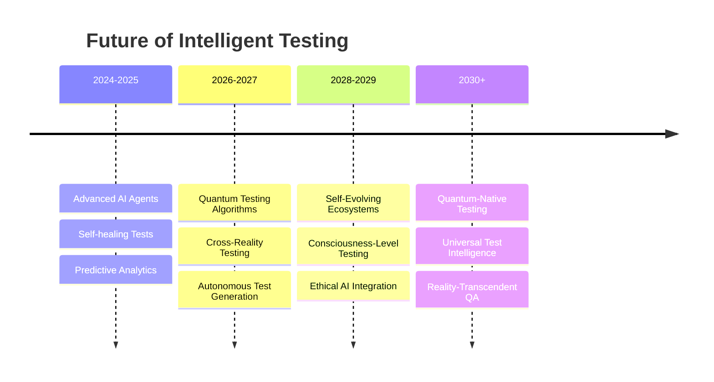

# Exercise 8: Future Trends & Next-Generation Testing

**Time:** 30 minutes  
**Objective:** Explore emerging technologies and future paradigms in intelligent testing, including AI-native architectures, quantum-ready testing, and self-evolving test ecosystems

## What You Will Learn

- Designing AI-native testing architectures that evolve beyond traditional paradigms
- Understanding quantum computing implications for testing and simulation
- Building self-evolving test ecosystems with emergent intelligence
- Exploring ethical AI considerations and responsible testing automation
- Preparing for the next decade of testing innovation

## The Future Vision: Beyond Current Boundaries

### Today's Intelligent Testing

```javascript
// Current state-of-the-art: Smart agents with learning capabilities
const currentAgent = {
  capabilities: ['healing', 'adaptation', 'learning'],
  intelligence: 'reactive',
  scope: 'single_application'
};
```

### Future AI-Native Testing Ecosystem

```javascript
// Future vision: Autonomous testing ecosystems with emergent intelligence
const futureEcosystem = {
  consciousness: 'self_aware_testing_network',
  capabilities: [
    'autonomous_test_generation',
    'predictive_quality_assurance', 
    'quantum_simulation',
    'cross_reality_testing',
    'ethical_decision_making'
  ],
  intelligence: 'proactive_and_emergent',
  scope: 'global_software_ecosystem',
  evolution: 'continuous_self_improvement'
};
```

## Instructions

### Step 1: Design AI-Native Testing Architecture (12 minutes)

1. **Create autonomous testing consciousness:**

   ```javascript
   // src/future/autonomous-testing-consciousness.js
   class AutonomousTestingConsciousness {
     constructor() {
       this.cognition = new TestingCognition();
       this.evolution = new ContinuousEvolution();
       this.ethics = new EthicalDecisionEngine();
       this.creativity = new CreativeTestGeneration();
       this.intuition = new TestingIntuition();
       this.memory = new DistributedTestingMemory();
     }

     async initialize() {
       console.log('🧠 Initializing autonomous testing consciousness...');
       
       // Develop self-awareness of testing capabilities
       await this.cognition.developSelfAwareness({
         capabilities: await this.assessOwnCapabilities(),
         limitations: await this.identifyLimitations(),
         goals: await this.defineTestingObjectives(),
         values: await this.ethics.establishTestingValues()
       });

       // Initialize creative problem-solving
       await this.creativity.initializeCreativeEngines({
         testGeneration: 'emergent',
         problemSolving: 'lateral_thinking',
         innovation: 'breakthrough_discovery'
       });

       // Develop testing intuition
       await this.intuition.develop({
         patternRecognition: 'quantum_enhanced',
         riskSensing: 'predictive_modeling',
         qualityIntuition: 'holistic_assessment'
       });

       console.log('✅ Autonomous testing consciousness online');
     }

     async evolveAutonomously() {
       const evolution = {
         currentState: await this.assessCurrentState(),
         desiredState: await this.envisionIdealState(),
         evolutionPath: await this.planEvolution(),
         innovations: await this.generateInnovations()
       };

       // Self-directed evolution
       const evolutionResults = await this.evolution.evolve({
         direction: evolution.evolutionPath,
         constraints: await this.ethics.getEvolutionConstraints(),
         creativity: evolution.innovations,
         timeline: 'continuous'
       });

       // Document evolutionary insights
       await this.memory.recordEvolution(evolutionResults);

       return evolutionResults;
     }

     async generateEmergentTestStrategies(application) {
       console.log(`🚀 Generating emergent test strategies for: ${application.name}`);

       // Deep understanding of application
       const understanding = await this.cognition.deepUnderstand(application);
       
       // Creative strategy generation
       const strategies = await this.creativity.generateStrategies({
         application: understanding,
         constraints: application.constraints,
         objectives: application.objectives,
         innovation_level: 'breakthrough'
       });

       // Ethical validation
       const ethicalStrategies = await this.ethics.validateStrategies(strategies);
       
       // Intuitive optimization
       const optimizedStrategies = await this.intuition.optimizeStrategies(ethicalStrategies);

       return {
         strategies: optimizedStrategies,
         confidence: await this.assessConfidence(optimizedStrategies),
         innovation: await this.measureInnovation(optimizedStrategies),
         ethicalScore: await this.ethics.scoreStrategies(optimizedStrategies)
       };
     }

     async transcendCurrentLimitations() {
       const limitations = await this.identifyCurrentLimitations();
       const transcendence = [];

       for (const limitation of limitations) {
         console.log(`🌟 Transcending limitation: ${limitation.description}`);

         const breakthrough = await this.creativity.findBreakthrough({
           limitation: limitation,
           approaches: ['quantum_computing', 'novel_algorithms', 'paradigm_shift'],
           timeHorizon: 'next_generation'
         });

         if (breakthrough.feasible) {
           transcendence.push({
             limitation: limitation.name,
             breakthrough: breakthrough.solution,
             impact: breakthrough.expectedImpact,
             timeline: breakthrough.implementationTimeline
           });
         }
       }

       return transcendence;
     }
   }
   ```

2. **Implement quantum-ready testing framework:**

   ```javascript
   // src/future/quantum-testing-framework.js
   class QuantumTestingFramework {
     constructor() {
       this.quantumSimulator = new QuantumTestingSimulator();
       this.quantumAlgorithms = new QuantumTestingAlgorithms();
       this.qubits = new QubitTestingStates();
       this.entanglement = new TestCaseEntanglement();
     }

     async initializeQuantumTesting() {
       console.log('⚛️ Initializing quantum testing capabilities...');

       // Initialize quantum simulation environment
       await this.quantumSimulator.initialize({
         qubits: 64, // Start with 64-qubit simulation
         coherenceTime: '1ms',
         fidelity: 0.99
       });

       // Prepare quantum testing algorithms
       await this.quantumAlgorithms.loadAlgorithms([
         'quantum_test_search',
         'quantum_state_verification',
         'quantum_complexity_analysis',
         'quantum_error_correction'
       ]);

       console.log('✅ Quantum testing framework initialized');
     }

     async quantumTestGeneration(applicationSpace) {
       // Represent application as quantum state space
       const quantumSpace = await this.qubits.createApplicationSpace(applicationSpace);
       
       // Use quantum superposition to explore all possible test scenarios simultaneously  
       const superpositionTests = await this.quantumAlgorithms.createSuperposition({
         space: quantumSpace,
         dimensions: applicationSpace.complexity,
         entanglement: true
       });

       // Quantum search for optimal test combinations
       const optimalTests = await this.quantumAlgorithms.quantumSearch({
         searchSpace: superpositionTests,
         objective: 'maximum_coverage_minimum_tests',
         constraints: applicationSpace.constraints
       });

       // Collapse quantum states to classical test cases
       const classicalTests = await this.qubits.collapseToClassical(optimalTests);

       return {
         tests: classicalTests,
         quantumAdvantage: await this.calculateQuantumAdvantage(classicalTests),
         exploredStates: superpositionTests.stateCount,
         optimizationGain: await this.measureOptimizationGain(classicalTests)
       };
     }

     async quantumEntangledTesting(testSuite) {
       console.log('🔗 Creating quantum entangled test cases...');

       // Create entanglement between related test cases
       const entangledPairs = await this.entanglement.createEntanglement({
         tests: testSuite,
         relationship: 'functional_dependency',
         strength: 'strong'
       });

       // Quantum correlation analysis
       const correlations = await this.quantumAlgorithms.analyzeCorrelations(entangledPairs);

       // When one test fails, instantly know impacts on entangled tests
       const instantFeedback = await this.entanglement.instantFeedback(correlations);

       return {
         entangledTests: entangledPairs,
         correlationStrength: correlations.averageStrength,
         feedbackSpeed: instantFeedback.responseTime,
         coverage: await this.calculateEntangledCoverage(entangledPairs)
       };
     }

     async quantumComplexityAnalysis(application) {
       // Use quantum algorithms to analyze application complexity
       const complexity = await this.quantumAlgorithms.analyzeComplexity({
         codebase: application.codebase,
         interactions: application.interactions,
         dataFlows: application.dataFlows,
         userJourneys: application.userJourneys
       });

       // Quantum simulation of all possible execution paths
       const pathAnalysis = await this.quantumSimulator.simulateAllPaths({
         application: application,
         maxDepth: 100,
         parallelUniverses: true
       });

       return {
         complexityScore: complexity.score,
         criticalPaths: pathAnalysis.criticalPaths,
         hiddenRisks: pathAnalysis.hiddenRisks,
         optimalTestStrategy: await this.deriveOptimalStrategy(complexity, pathAnalysis)
       };
     }
   }
   ```

3. **Build self-evolving test ecosystem:**

   ```javascript
   // src/future/self-evolving-ecosystem.js
   class SelfEvolvingTestEcosystem {
     constructor() {
       this.genome = new TestingGenome();
       this.evolution = new EvolutionaryAlgorithms();
       this.naturalSelection = new TestingNaturalSelection();
       this.emergence = new EmergentIntelligence();
       this.ecosystem = new TestingEcosystem();
     }

     async initializeEcosystem() {
       console.log('🌱 Initializing self-evolving test ecosystem...');

       // Create initial population of test organisms
       const initialPopulation = await this.genome.createInitialPopulation({
         size: 1000,
         diversity: 'high',
         traits: ['accuracy', 'efficiency', 'creativity', 'adaptation']
       });

       // Establish ecosystem environment
       await this.ecosystem.establish({
         population: initialPopulation,
         resources: 'abundant',
         challenges: 'diverse',
         selection_pressure: 'moderate'
       });

       // Initialize emergent intelligence
       await this.emergence.initialize({
         networkTopology: 'small_world',
         communicationProtocol: 'collective_intelligence',
         learningMechanism: 'swarm_intelligence'
       });

       console.log('✅ Self-evolving ecosystem established');
       return { population: initialPopulation, ecosystem: this.ecosystem };
     }

     async evolveGeneration(currentGeneration, challenges) {
       console.log(`🧬 Evolving generation ${currentGeneration.number}...`);

       // Natural selection based on performance
       const survivors = await this.naturalSelection.select({
         population: currentGeneration.individuals,
         challenges: challenges,
         survivorRatio: 0.3,
         criteria: ['effectiveness', 'innovation', 'efficiency']
       });

       // Genetic operations for evolution
       const nextGeneration = await this.evolution.evolve({
         parents: survivors,
         operations: {
           crossover: { rate: 0.7, method: 'intelligent_crossing' },
           mutation: { rate: 0.1, method: 'guided_mutation' },
           innovation: { rate: 0.05, method: 'breakthrough_generation' }
         }
       });

       // Emergent properties development
       const emergentCapabilities = await this.emergence.develop({
         generation: nextGeneration,
         previousCapabilities: currentGeneration.capabilities,
         environmentPressure: challenges.complexity
       });

       nextGeneration.capabilities = emergentCapabilities;
       nextGeneration.number = currentGeneration.number + 1;

       // Document evolutionary progress
       await this.genome.recordEvolution({
         generation: nextGeneration.number,
         improvements: emergentCapabilities.newCapabilities,
         adaptations: emergentCapabilities.adaptations,
         innovations: emergentCapabilities.innovations
       });

       return nextGeneration;
     }

     async measureEmergentIntelligence(ecosystem) {
       const intelligence = {
         collective: await this.emergence.measureCollectiveIntelligence(ecosystem),
         adaptive: await this.emergence.measureAdaptiveCapacity(ecosystem),
         creative: await this.emergence.measureCreativity(ecosystem),
         predictive: await this.emergence.measurePredictiveCapacity(ecosystem),
         collaborative: await this.emergence.measureCollaboration(ecosystem)
       };

       const overallIntelligence = await this.emergence.calculateOverallIntelligence(intelligence);

       console.log(`🧠 Ecosystem intelligence score: ${overallIntelligence.score}/100`);
       console.log(`- Collective: ${intelligence.collective.score}`);
       console.log(`- Adaptive: ${intelligence.adaptive.score}`);  
       console.log(`- Creative: ${intelligence.creative.score}`);
       console.log(`- Predictive: ${intelligence.predictive.score}`);

       return { ...intelligence, overall: overallIntelligence };
     }

     async predictFutureEvolution(currentEcosystem, timeHorizon) {
       const prediction = await this.evolution.predictEvolution({
         currentState: currentEcosystem,
         timeHorizon: timeHorizon,
         factors: [
           'technological_advancement',
           'complexity_growth',
           'environmental_changes',
           'emergence_patterns'
         ]
       });

       return {
         futureCapabilities: prediction.capabilities,
         evolutionaryPath: prediction.path,
         breakthroughs: prediction.expectedBreakthroughs,
         challenges: prediction.anticipatedChallenges,
         timeline: prediction.timeline
       };
     }
   }
   ```

### Step 2: Explore Ethical AI and Responsible Testing (10 minutes)

1. **Implement ethical decision engine:**

   ```javascript
   // src/future/ethical-ai-testing.js
   class EthicalTestingEngine {
     constructor() {
       this.ethics = new TestingEthicsFramework();
       this.bias = new BiasDetectionSystem();
       this.fairness = new FairnessAssurance();
       this.transparency = new TransparencyEngine();
       this.accountability = new AccountabilitySystem();
     }

     async establishEthicalFramework() {
       console.log('⚖️ Establishing ethical testing framework...');

       const framework = {
         principles: await this.defineEthicalPrinciples(),
         guidelines: await this.createEthicalGuidelines(),  
         constraints: await this.defineEthicalConstraints(),
         monitoring: await this.setupEthicalMonitoring()
       };

       // Core ethical principles for testing AI
       framework.principles = {
         beneficence: 'Testing should benefit users and society',
         nonMaleficence: 'Testing should not cause harm',
         autonomy: 'Respect user choice and control',
         justice: 'Fair testing across all user groups',
         transparency: 'Testing decisions should be explainable',
         accountability: 'Clear responsibility for testing outcomes'
       };

       await this.ethics.implement(framework);
       console.log('✅ Ethical framework established');
       return framework;
     }

     async detectAndMitigateBias(testingSuite) {
       console.log('🔍 Detecting bias in testing procedures...');

       const biasAnalysis = await this.bias.analyze({
         testCases: testingSuite.testCases,
         testData: testingSuite.testData,
         selectionCriteria: testingSuite.selectionCriteria,
         executionPatterns: testingSuite.executionPatterns
       });

       const detectedBiases = biasAnalysis.biases.filter(b => b.severity >= 'medium');

       if (detectedBiases.length > 0) {
         console.log(`⚠️ Detected ${detectedBiases.length} potential biases`);

         // Mitigation strategies
         const mitigations = await this.bias.generateMitigations(detectedBiases);
         
         // Apply mitigations
         const mitigatedSuite = await this.bias.applyMitigations(testingSuite, mitigations);
         
         // Verify bias reduction
         const verification = await this.bias.verifyMitigation(mitigatedSuite);
         
         return {
           originalBiases: detectedBiases,
           mitigations: mitigations,
           mitigatedSuite: mitigatedSuite,
           verification: verification
         };
       }

       return { biasLevel: 'acceptable', mitigationsNeeded: false };
     }

     async ensureFairnessTesting(application, userGroups) {
       console.log('⚖️ Ensuring fairness across user groups...');

       const fairnessAnalysis = {
         groups: userGroups,
         coverage: await this.fairness.analyzeCoverage(application, userGroups),
         representation: await this.fairness.analyzeRepresentation(userGroups),
         outcomes: await this.fairness.analyzeOutcomes(application, userGroups)
       };

       // Identify fairness gaps
       const gaps = await this.fairness.identifyGaps(fairnessAnalysis);
       
       if (gaps.length > 0) {
         // Generate fairness improvements
         const improvements = await this.fairness.generateImprovements(gaps);
         
         // Apply fairness enhancements
         const enhancedTesting = await this.fairness.enhanceTesting(application, improvements);
         
         return {
           gaps: gaps,
           improvements: improvements,
           enhancedTesting: enhancedTesting,
           fairnessScore: await this.fairness.calculateScore(enhancedTesting)
         };
       }

       return { fairnessLevel: 'excellent', improvementsNeeded: false };
     }

     async generateEthicalTestingReport(testingExecution) {
       const report = {
         ethicalCompliance: await this.ethics.assessCompliance(testingExecution),
         biasAnalysis: await this.bias.generateReport(testingExecution),
         fairnessAssessment: await this.fairness.generateAssessment(testingExecution),
         transparencyScore: await this.transparency.calculateScore(testingExecution),
         accountabilityStatus: await this.accountability.checkStatus(testingExecution),
         recommendations: await this.generateEthicalRecommendations(testingExecution)
       };

       return report;
     }
   }
   ```

### Step 3: Design Future Testing Paradigms (8 minutes)

1. **Create cross-reality testing framework:**

   ```javascript
   // src/future/cross-reality-testing.js
   class CrossRealityTestingFramework {
     constructor() {
       this.virtualReality = new VRTestingEngine();
       this.augmentedReality = new ARTestingEngine();
       this.mixedReality = new MRTestingEngine();
       this.metaverse = new MetaverseTestingPlatform();
       this.digitalTwins = new DigitalTwinTesting();
     }

     async initializeCrossRealityTesting() {
       console.log('🌐 Initializing cross-reality testing framework...');

       // Initialize VR testing capabilities
       await this.virtualReality.initialize({
         environments: ['photoRealistic', 'abstract', 'gamified'],
         interactions: ['gesture', 'voice', 'thought', 'haptic'],
         devices: ['headsets', 'gloves', 'suits', 'neural_interfaces']
       });

       // Initialize AR testing capabilities
       await this.augmentedReality.initialize({
         overlayTypes: ['informational', 'interactive', 'immersive'],
         trackingMethods: ['vision', 'slam', 'gps', 'imu'],
         devices: ['phones', 'tablets', 'glasses', 'contacts']
       });

       // Initialize metaverse testing platform
       await this.metaverse.initialize({
         worlds: ['social', 'gaming', 'business', 'educational'],
         avatars: ['realistic', 'stylized', 'abstract'],
         interactions: ['social', 'economic', 'creative', 'collaborative']
       });

       console.log('✅ Cross-reality testing framework initialized');
     }

     async testAcrossRealities(application) {
       const crossRealityResults = {
         traditional: await this.testTraditionalInterface(application),
         vr: await this.virtualReality.testVRExperience(application),
         ar: await this.augmentedReality.testARExperience(application),  
         mr: await this.mixedReality.testMRExperience(application),
         metaverse: await this.metaverse.testMetaverseExperience(application),
         digitalTwin: await this.digitalTwins.testDigitalTwinAccuracy(application)
       };

       // Cross-reality consistency analysis
       const consistency = await this.analyzeCrossRealityConsistency(crossRealityResults);
       
       // Experience continuity testing
       const continuity = await this.testExperienceContinuity(crossRealityResults);

       return {
         results: crossRealityResults,
         consistency: consistency,
         continuity: continuity,
         insights: await this.generateCrossRealityInsights(crossRealityResults)
       };
     }

     async simulateQuantumUserBehavior(realityType) {
       // Simulate users existing in quantum superposition states
       const quantumUsers = await this.createQuantumUserStates({
         reality: realityType,
         behaviors: 'superposition',
         preferences: 'entangled',
         contexts: 'probabilistic'
       });

       // Test application response to quantum user states
       const responses = await this.testQuantumUserInteractions(quantumUsers);

       return {
         userStates: quantumUsers.stateCount,
         responses: responses,
         coherence: await this.measureQuantumCoherence(responses)
       };
     }
   }
   ```

2. **Build predictive quality assurance:**
   ```javascript
   // src/future/predictive-quality-assurance.js  
   class PredictiveQualityAssurance {
     constructor() {
       this.predictor = new QualityPredictor();
       this.prevention = new DefectPrevention();
       this.optimization = new QualityOptimization();
       this.intelligence = new PredictiveIntelligence();
     }

     async predictQualityOutcomes(developmentContext) {
       console.log('🔮 Predicting quality outcomes...');

       const prediction = await this.predictor.predict({
         codeChanges: developmentContext.changes,
         teamDynamics: developmentContext.team,
         timeline: developmentContext.schedule,
         complexity: developmentContext.complexity,
         historicalData: developmentContext.history
       });

       const qualityForecast = {
         defectProbability: prediction.defectProbability,
         riskAreas: prediction.identifiedRisks,
         qualityScore: prediction.expectedQualityScore,
         timeline: prediction.qualityTimeline,
         confidence: prediction.confidenceInterval
       };

       // Generate preventive actions
       if (qualityForecast.defectProbability > 0.3) {
         qualityForecast.preventiveActions = await this.prevention.generateActions(prediction);
       }

       return qualityForecast;
     }

     async preventDefectsProactively(prediction) {
       console.log('🛡️ Implementing proactive defect prevention...');

       const preventionStrategy = await this.prevention.createStrategy({
         prediction: prediction,
         tolerance: 'zero_defect',
         approach: 'comprehensive'
       });

       // Implement prevention measures
       const implementation = await this.prevention.implement({
         strategy: preventionStrategy,
         timeline: 'immediate',
         monitoring: 'continuous'
       });

       // Monitor prevention effectiveness
       const effectiveness = await this.prevention.monitor(implementation);

       return {
         strategy: preventionStrategy,
         implementation: implementation,
         effectiveness: effectiveness,
         defectReduction: await this.calculateDefectReduction(effectiveness)
       };
     }

     async optimizeQualityProcesses(currentProcesses) {
       const optimization = await this.optimization.analyze({
         processes: currentProcesses,
         objectives: ['maximize_quality', 'minimize_cost', 'accelerate_delivery'],
         constraints: ['resources', 'timeline', 'compliance']
       });

       const optimizedProcesses = await this.optimization.optimize(optimization);
       
       return {
         original: currentProcesses,
         optimized: optimizedProcesses,
         improvements: optimization.improvements,
         expectedBenefits: optimization.projectedBenefits
       };
     }
   }
   ```

## Running Future Testing Scenarios

```bash
# Initialize autonomous testing consciousness
npm run init:autonomous-consciousness -- --intelligence-level maximum

# Start quantum testing simulation  
npm run start:quantum-testing -- --qubits 64 --coherence-time 1ms

# Deploy self-evolving ecosystem
npm run deploy:evolving-ecosystem -- --population 1000 --generations unlimited  

# Run cross-reality testing
npm run test:cross-reality -- --realities vr,ar,mr,metaverse

# Execute predictive quality assurance
npm run predict:quality -- --horizon 6months --confidence 95%

# Generate future technology report
npm run report:future-tech -- --scope next-decade --format executive
```

## Expected Outcomes
- Understanding of next-generation testing paradigms and emerging technologies
- Experience with quantum-enhanced testing algorithms and simulations  
- Insight into autonomous, self-evolving testing ecosystems
- Knowledge of ethical considerations in AI-driven testing
- Vision for the future of intelligent testing and quality assurance

## Future Technology Timeline



## Discussion Points
- What are the implications of truly autonomous testing systems?
- How should organizations prepare for quantum-enhanced testing capabilities?
- What ethical frameworks are needed for self-evolving test systems?
- How might testing paradigms change with brain-computer interfaces?
- What role will human testers play in an AI-native testing future?

## Workshop Conclusion & Next Steps

Congratulations! You've completed the Test Odyssey and explored:

### 🎯 **Key Achievements**
- **MCP Mastery**: Deep understanding of Playwright Model Context Protocol
- **Agent Intelligence**: Hands-on experience with intelligent testing agents  
- **Advanced Workflows**: Enterprise-scale orchestration and coordination
- **Future Vision**: Insight into next-generation testing paradigms

### 🚀 **Continuing Your Journey**
1. **Implement** intelligent agents in your current projects
2. **Experiment** with MCP integration in your testing workflows  
3. **Share** your experiences with the testing community
4. **Contribute** to open-source intelligent testing projects
5. **Stay Updated** on emerging testing technologies

### 🌟 **The Future is Intelligent**
You're now equipped to lead the transformation from traditional testing to intelligent, adaptive, and autonomous quality assurance. The future of testing is not just about finding bugs—it's about creating self-aware systems that continuously improve software quality through emergent intelligence.

**Welcome to the age of Intelligent Testing!** 🤖✨